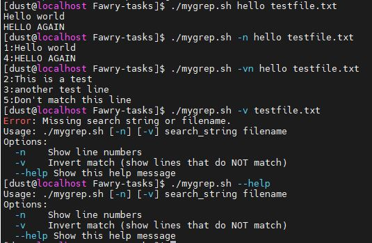

# 🛠️ Q1 : Custom Command (mygrep.sh)

## 📜 Description
**mygrep.sh** is a lightweight version of the Unix `grep` command, built in Bash. It supports:
- **Case-insensitive search** for a string in a text file.
- **Options** to show line numbers `-n`, invert matches `-v`, and combinations like `-vn` or `-nv`.
- **Robust error handling** for missing arguments or files.
- **Bonus features** like `--help` for usage instructions.
---

## 📋 Hands-On Validation

Tested using a `testfile.txt` with contents:
```
Hello world
This is a test
another test line
HELLO AGAIN
Don't match this line
Testing one two three
```

✅ Example screenshot to include:
- `./mygrep.sh hello testfile.txt`
- `./mygrep.sh -n hello testfile.txt`
- `./mygrep.sh -vn hello testfile.txt`
- `./mygrep.sh -v testfile.txt` (expect an error about missing search string)
- `./mygrep.sh --help`


---

## 🧠 Reflection

### 1. Argument and Option Handling Breakdown
- If `--help` is passed at any time, display usage information and exit.
- Options (`-n`, `-v`, or combinations like `-vn`) are parsed first.
- Then the script checks for the search string and filename.
- If arguments are missing or file doesn't exist, it shows an error.
- Searching is performed using `grep -i`, with flags added based on the parsed options.

### 2. Supporting Additional Options
If I wanted to add features like:
- `-i` (ignore case, already somewhat done),
- `-c` (count number of matching lines),
- `-l` (list only filenames with matches),

...I would refactor the script to fully rely on `getopts`, allowing easy parsing of each new flag and maintaining a cleaner structure. Also, I'd build dynamic `grep` command strings based on active flags.

### 3. Hardest Part
The most challenging part was **correctly handling combined options** (e.g., `-vn`, `-nv`) because the order should not matter. I had to make sure my script parsed each character individually rather than expecting full-word options, mimicking real `grep` behavior.

--------------------------------------
# 🛠️ Q2 : Scenario

## 1. Verify DNS Resolution


### Compare DNS Resolution:

- **Check using Google's Public DNS (8.8.8.8):**
  ```bash
  dig internal.example.com
  ```
  

- **Check using system's configured DNS:**
  ```bash
  dig @192.168.138.2 internal.example.com
  ```


---

## 2. Diagnose Service Reachability

### Steps to Confirm Web Service is Listening:

- **Resolve the IP address manually (if dig was successful):**
  ```bash
  dig +short internal.example.com
  ```

- **Check if the port is open (port 80 or 443):**
  ```bash
  curl -v http://internal.example.com
  ```

  or

  ```bash
  telnet internal.example.com 80
  ```

  or using `ss` to check locally:
  ```bash
  sudo ss -tuln | grep ':80\|:443'
  ```


---

## 3. Trace the Issue – List All Possible Causes

| Layer  | Potential Cause                                      |
|--------|------------------------------------------------------|
| DNS    | Misconfigured `/etc/resolv.conf`                     |
| DNS    | Internal DNS server outage or misconfiguration       |
| DNS    | Split-horizon DNS issue (internal zone not resolving) |
| Network| Firewall blocking DNS (port 53) or HTTP/HTTPS        |
| Network| Routing issues between client and server             |
| Host   | Service listening only on `localhost` (127.0.0.1)    |
| Host   | SELinux or firewall rules blocking access            |

---

## 4. Propose and Apply Fixes

### For Each Potential Cause:

---

### 1. Misconfigured `/etc/resolv.conf`

- **Confirm:**
  ```bash
  cat /etc/resolv.conf
  ```
- **Fix:**
  Edit `/etc/resolv.conf` to correct DNS servers:
  ```bash
  sudo vi /etc/resolv.conf
  ```
  Example entry:
  ```
  nameserver 8.8.8.8
  ```


---

### 2. Internal DNS Server Outage

- **Confirm:**
  ```bash
  dig @<internal-dns-ip> internal.example.com
  ```
- **Fix:**
  Restart DNS service on internal server:
  ```bash
  sudo systemctl restart named
  ```


---

### 3. Split-horizon DNS Issue

- **Confirm:**
  Compare DNS results from internal vs external DNS servers (Using dig @dns internal.example.com)

- **Fix:**
  Update internal DNS zone configuration to properly resolve `internal.example.com`.


---

### 4. Firewall Blocking

- **Confirm:**
  ```bash
  sudo iptables -L -n | grep 53
  sudo iptables -L -n | grep 80
  sudo iptables -L -n | grep 443
  ```
- **Fix:**
  Open necessary ports:
  ```bash
  sudo iptables -A INPUT -p tcp --dport 80 -j ACCEPT
  sudo iptables -A INPUT -p tcp --dport 443 -j ACCEPT
  sudo iptables -A INPUT -p udp --dport 53 -j ACCEPT
  sudo iptables -A INPUT -p tcp --dport 53 -j ACCEPT
  ```

---

### 5. Routing Issues

- **Confirm:**
  ```bash
  traceroute internal.example.com
  ```
- **Fix:**
  Update routing tables or investigate intermediate routers/firewalls.
  ```bash
  sudo ip route add 192.168.1.0/24 via 192.168.138.2
  ```

---

### 6. SELinux or Firewall Restrictions

- **Confirm:**
  ```bash
  sudo getenforce
  ```
- **Fix:**
  Set SELinux to permissive temporarily:
  ```bash
  sudo setenforce 0
  ```

---

# 🏆 Bonus Tasks

### Configure Local `/etc/hosts` Entry for Testing

- **Edit `/etc/hosts`:**
  ```bash
  sudo vi /etc/hosts
  ```
  Add:
  ```
  192.168.138.10 internal.example.com
  ```


- **Test:**
  ```bash
  ping internal.example.com
  curl http://internal.example.com
  ```

---

### Persist DNS Settings (Systemd-resolved)

- **Using systemd-resolved:**
  - Create or edit `/etc/systemd/resolved.conf`
    ```bash
    [Resolve]
    DNS=192.168.138.2
    FallbackDNS=8.8.8.8
    ```
  - Restart service:
    ```bash
    sudo systemctl restart systemd-resolved
    ```

